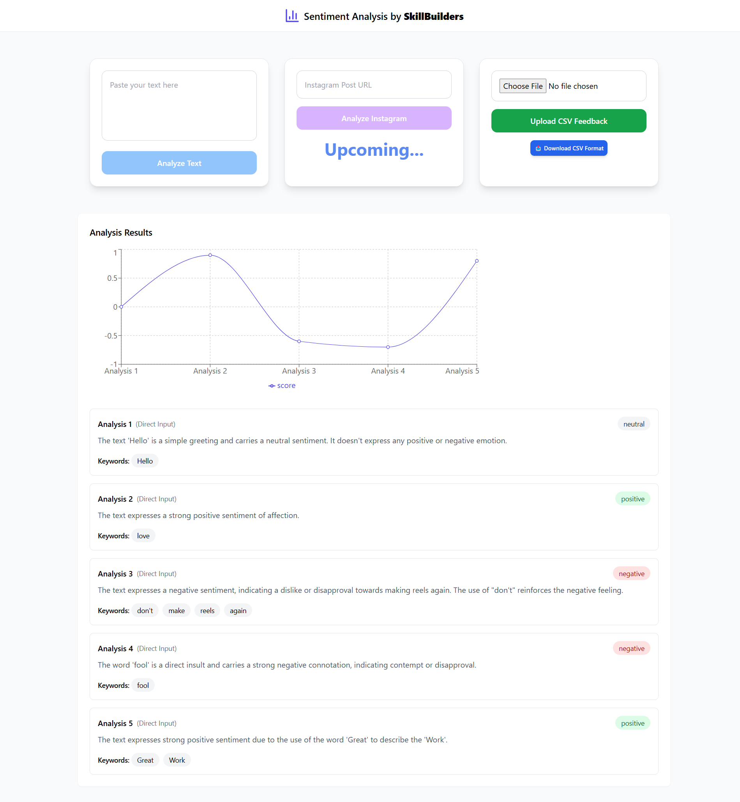

# Sentiment Analytics by Skill Builders

## Introduction
Sentiment Analytics by Skill Builders is a powerful tool designed to analyze sentiment from various sources, including direct text input, social media comments (e.g., Instagram), and CSV feedback files. This project leverages the Google Gemini AI API to perform sentiment analysis, extracting key insights such as sentiment polarity, keywords, and summarized feedback.

## Features
- **Direct Text Analysis**: Users can input text manually to get instant sentiment insights.
- **Instagram Comment Analysis** (Upcoming Feature): Analyze comments from Instagram posts to gauge audience sentiment.
- **CSV File Upload**: Bulk sentiment analysis by uploading CSV files containing user feedback.
- **Real-time Data Visualization**: Results are displayed in an interactive line chart for easy trend analysis.
- **Local Storage Persistence**: Analysis results are stored in local storage for future reference.

## Technologies Used
- **Frontend**: React, Tailwind CSS, Framer Motion
- **Backend**: Node.js, Prisma, MySQL (for storing results)
- **AI Model**: Google Gemini API for sentiment analysis
- **Charting**: Recharts for visual representation of sentiment scores

## How It Works
1. **Enter Text Manually**
   - Users can type or paste a text snippet into the input box and analyze its sentiment instantly.
2. **Instagram Comments Analysis (Upcoming Feature)**
   - Users will be able to enter an Instagram post URL to fetch and analyze comments (currently disabled).
3. **Upload CSV File**
   - Users can upload a CSV file containing feedback, which is processed to determine sentiment trends.
4. **View Analysis Results**
   - Sentiment scores are displayed, along with keyword extractions and a summary of the feedback.
5. **Data Visualization**
   - Sentiment trends are plotted in a line chart for an easy-to-understand visual representation.

## Getting Started
### Prerequisites
- Node.js & npm/yarn installed
- API key for Google Gemini AI

### Installation
1. Clone the repository:
   ```sh
   git clone https://github.com/your-repo/sentiment-analytics.git
   ```
2. Navigate to the project folder:
   ```sh
   cd sentiment-analytics
   ```
3. Install dependencies:
   ```sh
   npm install
   ```
4. Set up environment variables:
   - Create a `.env` file and add your Google Gemini API key:
     ```env
     VITE_GEMINI_API_KEY=your_api_key_here
     ```

### Running the Application
```sh
npm run dev
```
The application will be accessible at `http://localhost:3000/`.

## Future Enhancements
- **Full Instagram Comments Processing**
- **Improved Data Insights with AI-based Summarization**
- **User Authentication & Data Storage with MySQL**
- **Enhanced UI/UX for Better Usability**

## Preview


## Contributing
Contributions are welcome! Feel free to submit issues, feature requests, or pull requests to help improve this project.

## License
This project is licensed under the MIT License.
